# Database ERD

All tables and their key relationships, as defined across `supabase/migrations/0001`–`0016`. Enum columns (`status`, `decision`, `winner_category`, etc.) are omitted from field lists below where obvious from context — see the migration files for exact enum values.

```mermaid
erDiagram
    PROFILES ||--o{ USER_ROLES : "has"
    ROLES ||--o{ USER_ROLES : "granted as"
    PROFILES ||--o| MENTOR_PROFILES : "is a"

    PROGRAMS ||--o{ PROGRAM_STAGES : "has"
    PROGRAMS ||--o{ PROGRAM_CONTENT : "has"
    PROGRAMS ||--o{ PROGRAM_RESOURCES : "has"
    PROGRAMS ||--o{ IDEAS : "receives"
    PROGRAMS ||--o{ VOTING_PERIODS : "schedules"
    PROGRAMS ||--o{ SHOWCASE_PROJECTS : "publishes"
    PROGRAMS ||--o{ FINAL_PRESENTATION_ASSESSMENTS : "scopes"
    PROGRAMS ||--o{ PUBLICATIONS : "scopes"
    PROGRAMS ||--o{ AUDIT_LOGS : "scopes"

    PROFILES ||--o{ IDEAS : "leads / creates"
    IDEAS ||--o{ IDEA_TEAM_MEMBERS : "has"
    PROFILES ||--o{ IDEA_TEAM_MEMBERS : "is member of"
    IDEAS ||--o{ IDEA_IMPACTS : "declares"
    IDEAS ||--o{ IDEA_SUPPORT_REQUESTS : "requests"
    IDEAS ||--o{ IDEA_MENTOR_PREFERENCES : "prefers"
    MENTOR_PROFILES ||--o{ IDEA_MENTOR_PREFERENCES : "preferred as"

    IDEAS ||--o| REVIEW_ASSIGNMENTS : "routed via"
    MENTOR_PROFILES ||--o{ REVIEW_ASSIGNMENTS : "assigned to"
    REVIEW_ASSIGNMENTS ||--o{ REVIEWS : "produces"
    IDEAS ||--o{ REVIEWS : "reviewed by"
    PROFILES ||--o{ REVIEWS : "written by"

    IDEAS ||--o| SCREENING_DECISIONS : "screened as"
    PROFILES ||--o{ SCREENING_DECISIONS : "decided by"

    IDEAS ||--o| QUALIFIER_ASSESSMENTS : "qualified as"
    PROFILES ||--o{ QUALIFIER_ASSESSMENTS : "decided by"

    IDEAS ||--o| PROJECT_MENTOR_ASSIGNMENTS : "assigned mentor via"
    MENTOR_PROFILES ||--o{ PROJECT_MENTOR_ASSIGNMENTS : "assigned as"
    PROFILES ||--o{ PROJECT_MENTOR_ASSIGNMENTS : "assigned by"

    IDEAS ||--o| FINAL_PRESENTATION_ASSESSMENTS : "presented as"
    PROFILES ||--o{ FINAL_PRESENTATION_ASSESSMENTS : "decided by"

    IDEAS ||--o| SHOWCASE_PROJECTS : "showcased as"

    VOTING_PERIODS ||--o{ VOTES : "collects"
    IDEAS ||--o{ VOTES : "receives"
    PROFILES ||--o{ VOTES : "casts"

    PROFILES ||--o{ PUBLICATIONS : "published by"
    PROFILES ||--o{ NOTIFICATIONS : "receives"
    PROFILES ||--o{ AUDIT_LOGS : "acted as"

    PROFILES {
        uuid id PK
        text employee_id
        text email
        text full_name
        text job_title
        text department
        boolean active
    }

    ROLES {
        uuid id PK
        role_name name
    }

    USER_ROLES {
        uuid id PK
        uuid user_id FK
        uuid role_id FK
    }

    MENTOR_PROFILES {
        uuid id PK
        uuid profile_id FK
        text expertise
        int max_capacity
    }

    PROGRAMS {
        uuid id PK
        text title
        timestamptz submission_open_at
        timestamptz submission_close_at
        timestamptz screening_close_at
        timestamptz qualifier_close_at
        timestamptz final_presentation_close_at
        timestamptz showcase_open_at
        timestamptz voting_open_at
        timestamptz voting_close_at
        program_status status
    }

    PROGRAM_STAGES {
        uuid id PK
        uuid program_id FK
        program_stage_key stage_key
        timestamptz starts_at
        timestamptz ends_at
    }

    PROGRAM_CONTENT {
        uuid id PK
        uuid program_id FK
        text key
        text title
        text body
    }

    PROGRAM_RESOURCES {
        uuid id PK
        uuid program_id FK
        text title
        text file_url
    }

    IDEAS {
        uuid id PK
        uuid program_id FK
        text team_name
        uuid team_leader_id FK
        text idea_title
        text problem_opportunity
        text proposed_solution
        idea_status status
        boolean locked
        uuid created_by FK
    }

    IDEA_TEAM_MEMBERS {
        uuid id PK
        uuid idea_id FK
        uuid profile_id FK
        int member_order
    }

    IDEA_IMPACTS {
        uuid id PK
        uuid idea_id FK
        impact_kind impact_kind
        impact_type impact_type
        text explanation
    }

    IDEA_SUPPORT_REQUESTS {
        uuid id PK
        uuid idea_id FK
        support_area support_area
        text details
    }

    IDEA_MENTOR_PREFERENCES {
        uuid id PK
        uuid idea_id FK
        int priority
        uuid mentor_profile_id FK
    }

    REVIEW_ASSIGNMENTS {
        uuid id PK
        uuid idea_id FK
        uuid mentor_profile_id FK
        review_assignment_status status
    }

    REVIEWS {
        uuid id PK
        uuid review_assignment_id FK
        uuid idea_id FK
        uuid reviewer_id FK
        review_recommendation recommendation
        review_status status
        int version
    }

    SCREENING_DECISIONS {
        uuid id PK
        uuid idea_id FK
        screening_decision_value decision
        boolean differs_from_recommendation
        text internal_reason
        boolean published
    }

    QUALIFIER_ASSESSMENTS {
        uuid id PK
        uuid idea_id FK
        numeric final_score
        build_decision build_decision
        qualifier_status status
        boolean published
    }

    PROJECT_MENTOR_ASSIGNMENTS {
        uuid id PK
        uuid idea_id FK
        uuid mentor_profile_id FK
        boolean published
    }

    FINAL_PRESENTATION_ASSESSMENTS {
        uuid id PK
        uuid idea_id FK
        uuid program_id FK
        numeric final_score
        winner_decision winner_decision
        winner_category winner_category
        final_presentation_status status
        boolean published
    }

    SHOWCASE_PROJECTS {
        uuid id PK
        uuid idea_id FK
        uuid program_id FK
        text image_url
        text short_description
        boolean published
    }

    VOTING_PERIODS {
        uuid id PK
        uuid program_id FK
        timestamptz opens_at
        timestamptz closes_at
        boolean results_published
        boolean show_percentages
    }

    VOTES {
        uuid id PK
        uuid voting_period_id FK
        uuid voter_id FK
        uuid idea_id FK
    }

    PUBLICATIONS {
        uuid id PK
        uuid program_id FK
        text entity_type
        uuid entity_id
        uuid published_by FK
    }

    NOTIFICATIONS {
        uuid id PK
        uuid user_id FK
        text type
        text title
        boolean read
    }

    EMAIL_OUTBOX {
        uuid id PK
        text to_email
        text subject
        email_outbox_status status
    }

    AUDIT_LOGS {
        uuid id PK
        uuid program_id FK
        text entity_type
        uuid entity_id
        uuid actor_id FK
        text action
        jsonb prior_value
        jsonb new_value
        uuid correlation_id
    }
```

## Notes

- `entity_id` on `PUBLICATIONS` and `AUDIT_LOGS` is a polymorphic reference (no single FK target) — `entity_type` says which table it points into. This is why the Audit Log viewer's "jump to entity" links are built from `entity_type` + `entity_id` rather than a real foreign key.
- Every `*_ASSESSMENTS` / `*_DECISIONS` / `*_ASSIGNMENTS` table (`screening_decisions`, `qualifier_assessments`, `project_mentor_assignments`, `final_presentation_assessments`, `showcase_projects`) has a `unique(idea_id)` constraint — one row per idea per stage, upserted in place rather than versioned, which is why "Save ≠ Finalize ≠ Publish" is expressed as boolean/status columns on that single row instead of an append-only history.
- `reviews.version` + `reopened_at`/`reopen_reason` is the review table's own light history mechanism — a reopened review is edited in place with those fields recording the fact, not stored as a new row.
