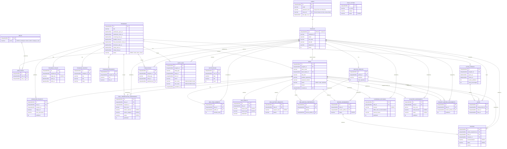

# Database ERD

All tables and their key relationships in the SQL Server 2019 `aidea` database, as defined in `db/migrations/0001_schema.sql` (triggers in `0002_triggers.sql`, stored procedures in `0003_procedures.sql`). Types are SQL Server types: ids are `UNIQUEIDENTIFIER`, timestamps `DATETIMEOFFSET(3)`, flags `BIT`, text `NVARCHAR`. The former Postgres enums are `NVARCHAR` columns with a `CHECK` constraint (marked `"CHECK"` below) — see `0001_schema.sql` for the exact allowed values. Only key columns are listed. `supabase/migrations/` is kept only as historical reference.

```mermaid
erDiagram
    USERS ||--|| PROFILES : "has"
    PROFILES ||--o{ USER_ROLES : "has"
    ROLES ||--o{ USER_ROLES : "granted as"
    PROFILES ||--o| MENTOR_PROFILES : "is a"

    PROGRAMS ||--o{ PROGRAM_STAGES : "has"
    PROGRAMS ||--o{ PROGRAM_CONTENT : "has"
    PROGRAMS ||--o{ PROGRAM_RESOURCES : "has"
    PROGRAMS ||--o{ IDEAS : "receives"
    PROGRAMS ||--o{ VOTING_PERIODS : "schedules"
    PROGRAMS ||--o{ SHOWCASE_PROJECTS : "publishes"
    PROGRAMS ||--o{ FINAL_PRESENTATION_ASSESSMENTS : "scopes"
    PROGRAMS ||--o{ PUBLICATIONS : "scopes"
    PROGRAMS ||--o{ AUDIT_LOGS : "scopes"

    PROFILES ||--o{ IDEAS : "leads / creates"
    IDEAS ||--o{ IDEA_TEAM_MEMBERS : "has"
    PROFILES ||--o{ IDEA_TEAM_MEMBERS : "is member of"
    IDEAS ||--o{ IDEA_IMPACTS : "declares"
    IDEAS ||--o{ IDEA_SUPPORT_REQUESTS : "requests"
    IDEAS ||--o{ IDEA_MENTOR_PREFERENCES : "prefers"
    MENTOR_PROFILES ||--o{ IDEA_MENTOR_PREFERENCES : "preferred as"

    IDEAS ||--o| REVIEW_ASSIGNMENTS : "routed via"
    MENTOR_PROFILES ||--o{ REVIEW_ASSIGNMENTS : "assigned to"
    REVIEW_ASSIGNMENTS ||--o{ REVIEWS : "produces"
    IDEAS ||--o{ REVIEWS : "reviewed by"
    PROFILES ||--o{ REVIEWS : "written by"

    IDEAS ||--o| SCREENING_DECISIONS : "screened as"
    PROFILES ||--o{ SCREENING_DECISIONS : "decided by"

    IDEAS ||--o| QUALIFIER_ASSESSMENTS : "qualified as"
    PROFILES ||--o{ QUALIFIER_ASSESSMENTS : "decided by"

    IDEAS ||--o| PROJECT_MENTOR_ASSIGNMENTS : "assigned mentor via"
    MENTOR_PROFILES ||--o{ PROJECT_MENTOR_ASSIGNMENTS : "assigned as"
    PROFILES ||--o{ PROJECT_MENTOR_ASSIGNMENTS : "assigned by"

    IDEAS ||--o| FINAL_PRESENTATION_ASSESSMENTS : "presented as"
    PROFILES ||--o{ FINAL_PRESENTATION_ASSESSMENTS : "decided by"

    IDEAS ||--o| SHOWCASE_PROJECTS : "showcased as"

    VOTING_PERIODS ||--o{ VOTES : "collects"
    IDEAS ||--o{ VOTES : "receives"
    PROFILES ||--o{ VOTES : "casts"

    PROFILES ||--o{ PUBLICATIONS : "published by"
    PROFILES ||--o{ NOTIFICATIONS : "receives"
    PROFILES ||--o{ AUDIT_LOGS : "acted as"

    USERS {
        uniqueidentifier id PK
        nvarchar email UK
        nvarchar password_hash "bcrypt, NULL for SSO-only"
        nvarchar entra_oid UK "Entra ID object id, NULL unless linked"
        datetimeoffset last_sign_in_at
    }

    PROFILES {
        uniqueidentifier id PK, FK "= users.id"
        nvarchar employee_id
        nvarchar email
        nvarchar full_name
        nvarchar job_title
        nvarchar department
        bit active
    }

    ROLES {
        uniqueidentifier id PK
        nvarchar name "CHECK: participant, mentor, admin, employee_voter"
    }

    USER_ROLES {
        uniqueidentifier id PK
        uniqueidentifier user_id FK
        uniqueidentifier role_id FK
    }

    MENTOR_PROFILES {
        uniqueidentifier id PK
        uniqueidentifier profile_id FK
        nvarchar expertise
        int max_capacity
    }

    PROGRAMS {
        uniqueidentifier id PK
        nvarchar title
        datetimeoffset submission_open_at
        datetimeoffset submission_close_at
        datetimeoffset screening_close_at
        datetimeoffset qualifier_close_at
        datetimeoffset final_presentation_close_at
        datetimeoffset showcase_open_at
        datetimeoffset voting_open_at
        datetimeoffset voting_close_at
        nvarchar status "CHECK: draft, active, closed"
    }

    PROGRAM_STAGES {
        uniqueidentifier id PK
        uniqueidentifier program_id FK
        nvarchar stage_key "CHECK"
        datetimeoffset starts_at
        datetimeoffset ends_at
    }

    PROGRAM_CONTENT {
        uniqueidentifier id PK
        uniqueidentifier program_id FK
        nvarchar key
        nvarchar title
        nvarchar body
    }

    PROGRAM_RESOURCES {
        uniqueidentifier id PK
        uniqueidentifier program_id FK
        nvarchar title
        nvarchar file_url
    }

    IDEAS {
        uniqueidentifier id PK
        uniqueidentifier program_id FK
        nvarchar team_name
        uniqueidentifier team_leader_id FK
        nvarchar idea_title
        nvarchar problem_opportunity
        nvarchar proposed_solution
        nvarchar status "CHECK: draft, submitted"
        bit locked
        uniqueidentifier created_by FK
    }

    IDEA_TEAM_MEMBERS {
        uniqueidentifier id PK
        uniqueidentifier idea_id FK
        uniqueidentifier profile_id FK
        int member_order
    }

    IDEA_IMPACTS {
        uniqueidentifier id PK
        uniqueidentifier idea_id FK
        nvarchar impact_kind "CHECK"
        nvarchar impact_type "CHECK"
        nvarchar explanation
    }

    IDEA_SUPPORT_REQUESTS {
        uniqueidentifier id PK
        uniqueidentifier idea_id FK
        nvarchar support_area "CHECK"
        nvarchar details
    }

    IDEA_MENTOR_PREFERENCES {
        uniqueidentifier id PK
        uniqueidentifier idea_id FK
        int priority
        uniqueidentifier mentor_profile_id FK
    }

    REVIEW_ASSIGNMENTS {
        uniqueidentifier id PK
        uniqueidentifier idea_id FK
        uniqueidentifier mentor_profile_id FK
        nvarchar status "CHECK"
    }

    REVIEWS {
        uniqueidentifier id PK
        uniqueidentifier review_assignment_id FK
        uniqueidentifier idea_id FK
        uniqueidentifier reviewer_id FK
        nvarchar recommendation "CHECK"
        nvarchar status "CHECK"
        int version
    }

    SCREENING_DECISIONS {
        uniqueidentifier id PK
        uniqueidentifier idea_id FK
        nvarchar decision "CHECK"
        bit differs_from_recommendation
        nvarchar internal_reason
        bit published
    }

    QUALIFIER_ASSESSMENTS {
        uniqueidentifier id PK
        uniqueidentifier idea_id FK
        decimal final_score
        nvarchar build_decision "CHECK"
        nvarchar status "CHECK"
        bit published
    }

    PROJECT_MENTOR_ASSIGNMENTS {
        uniqueidentifier id PK
        uniqueidentifier idea_id FK
        uniqueidentifier mentor_profile_id FK
        bit published
    }

    FINAL_PRESENTATION_ASSESSMENTS {
        uniqueidentifier id PK
        uniqueidentifier idea_id FK
        uniqueidentifier program_id FK
        decimal final_score
        nvarchar winner_decision "CHECK"
        nvarchar winner_category "CHECK"
        nvarchar status "CHECK"
        bit published
    }

    SHOWCASE_PROJECTS {
        uniqueidentifier id PK
        uniqueidentifier idea_id FK
        uniqueidentifier program_id FK
        nvarchar image_url
        nvarchar short_description
        bit published
    }

    VOTING_PERIODS {
        uniqueidentifier id PK
        uniqueidentifier program_id FK
        datetimeoffset opens_at
        datetimeoffset closes_at
        bit results_published
        bit show_percentages
    }

    VOTES {
        uniqueidentifier id PK
        uniqueidentifier voting_period_id FK
        uniqueidentifier voter_id FK
        uniqueidentifier idea_id FK
    }

    PUBLICATIONS {
        uniqueidentifier id PK
        uniqueidentifier program_id FK
        nvarchar entity_type
        uniqueidentifier entity_id
        uniqueidentifier published_by FK
    }

    NOTIFICATIONS {
        uniqueidentifier id PK
        uniqueidentifier user_id FK
        nvarchar type
        nvarchar title
        bit read
    }

    EMAIL_OUTBOX {
        uniqueidentifier id PK
        nvarchar to_email
        nvarchar subject
        nvarchar status "CHECK"
    }

    AUDIT_LOGS {
        uniqueidentifier id PK
        uniqueidentifier program_id FK
        nvarchar entity_type
        uniqueidentifier entity_id
        uniqueidentifier actor_id FK
        nvarchar action
        nvarchar prior_value "JSON (ISJSON check)"
        nvarchar new_value "JSON (ISJSON check)"
        uniqueidentifier correlation_id
    }
```

## Notes

- `users` holds sign-in credentials and replaces Supabase's `auth.users`: `password_hash` (bcrypt) for email + password sign-in, `entra_oid` for a linked Microsoft Entra ID identity. `profiles.id` is both its primary key and a foreign key to `users.id` (one-to-one, `ON DELETE CASCADE`). Everything else references `profiles`, never `users`.
- `ideas.team_leader_id` is chosen explicitly in the submission wizard (a required Team Leader picker) and can differ from `ideas.created_by`. The leader is not stored in `idea_team_members`, which holds up to 5 further members (limit enforced by the app, not the schema). Both creator and leader may submit the idea, and `dbo.fn_is_idea_team_member` treats the leader as a team member for the own-team voting guard.
- `audit_logs.prior_value` / `new_value` are JSON stored as `NVARCHAR(MAX)` with an `ISJSON` check constraint.
- Nullable unique columns (`users.entra_oid`, `profiles.employee_id`) use filtered unique indexes, because a SQL Server `UNIQUE` constraint allows only one `NULL`. The one-grand-winner / one-runner-up-per-program rules are also filtered unique indexes on `final_presentation_assessments.program_id`, which `trg_final_presentation_program_id` keeps in sync with the idea's program.
- SQL Server rejects multiple cascade paths into one table, so three foreign keys are `NO ACTION` instead of `ON DELETE CASCADE`: `reviews.idea_id`, `final_presentation_assessments.program_id` and `showcase_projects.program_id`. Those rows are still deleted with their idea or program, through the other cascade path (via `review_assignments` or `ideas`).
- The Supabase-era views `ideas_participant_view` and `reviews_participant_safe` no longer exist. The participant-safe column selection lives in the service-layer SQL instead.
- `entity_id` on `PUBLICATIONS` and `AUDIT_LOGS` is a polymorphic reference (no single FK target) — `entity_type` says which table it points into. This is why the Audit Log viewer's "jump to entity" links are built from `entity_type` + `entity_id` rather than a real foreign key.
- Every `*_ASSESSMENTS` / `*_DECISIONS` / `*_ASSIGNMENTS` table (`screening_decisions`, `qualifier_assessments`, `project_mentor_assignments`, `final_presentation_assessments`, `showcase_projects`) has a `unique(idea_id)` constraint — one row per idea per stage, upserted in place rather than versioned, which is why "Save ≠ Finalize ≠ Publish" is expressed as boolean/status columns on that single row instead of an append-only history.
- `reviews.version` + `reopened_at`/`reopen_reason` is the review table's own light history mechanism — a reopened review is edited in place with those fields recording the fact, not stored as a new row.
