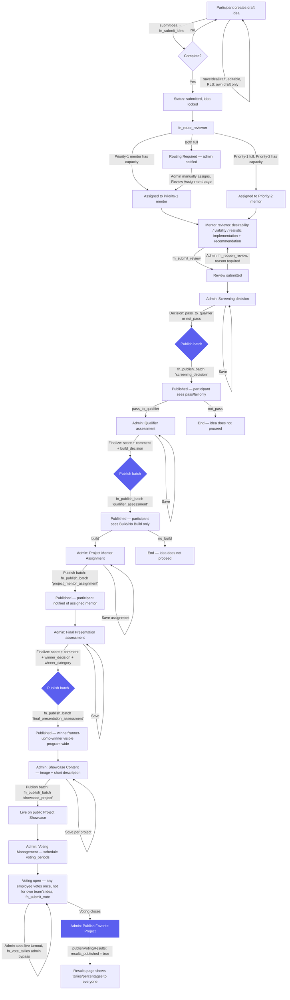

# Idea Lifecycle Workflow

The full path an idea takes from a participant's first draft to a possible Grand Winner on the public Project Showcase, including every publish gate.

## Notes

- Every diamond/box labeled **"Publish batch"** or **"Publish Favorite Project"** is a distinct, explicitly confirmed action (typed "PUBLISH" confirmation in the UI) — never triggered automatically by Save or Finalize. This is the "Save ≠ Finalize ≠ Publish" principle enforced throughout the admin decision screens (see `SECURITY.md`).
- The two "End" branches (`not_pass` at screening, `no_build` at qualifier) are dead ends for that idea's forward progress through the program, but the idea's own record and its published decision remain visible to its team on `/my-ideas` — "end of the workflow" means no further stage runs against it, not that it disappears.
- Notifications (not drawn as separate nodes to keep this readable) fire at: reviewer assigned, routing required (admin), review reopened, every publish step above, voting opened, voting closing reminder (cron), and voting result published. See `lib/notifications/categorize.ts` for how the Notifications center buckets these.
