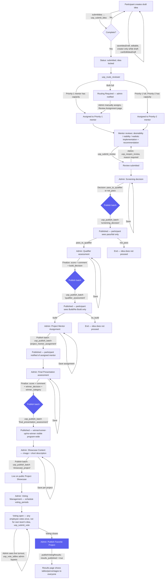

# Idea Lifecycle Workflow

The full path an idea takes from a participant's first draft to a possible Grand Winner on the public Project Showcase, including every publish gate.

```mermaid
flowchart TD
    A[Participant creates draft idea] -->|saveIdeaDraft, editable, creator only while draft: canEditIdeaDraft| A
    A -->|submitIdea → usp_submit_idea| B{Complete?}
    B -->|No| A
    B -->|Yes| C[Status: submitted, idea locked]
    C --> D[usp_route_reviewer]

    D -->|Priority-1 mentor has capacity| E1[Assigned to Priority-1 mentor]
    D -->|Priority-1 full, Priority-2 has capacity| E2[Assigned to Priority-2 mentor]
    D -->|Both full| E3[Routing Required — admin notified]
    E3 -->|Admin manually assigns, Review Assignment page| E1

    E1 --> F[Mentor reviews: desirability / viability / realistic implementation + recommendation]
    E2 --> F
    F -->|usp_submit_review| G[Review submitted]
    G -->|Admin: usp_reopen_review, reason required| F

    G --> H[Admin: Screening decision]
    H -->|Save| H
    H -->|Decision: pass_to_qualifier or not_pass| I{Publish batch}
    I -->|usp_publish_batch 'screening_decision'| J[Published — participant sees pass/fail only]

    J -->|pass_to_qualifier| K[Admin: Qualifier assessment]
    J -->|not_pass| Z1[End — idea does not proceed]

    K -->|Save| K
    K -->|Finalize: score + comment + build_decision| L{Publish batch}
    L -->|usp_publish_batch 'qualifier_assessment'| M[Published — participant sees Build/No Build only]

    M -->|build| N[Admin: Project Mentor Assignment]
    M -->|no_build| Z2[End — idea does not proceed]

    N -->|Save assignment| N
    N -->|Publish batch: usp_publish_batch 'project_mentor_assignment'| O[Published — participant notified of assigned mentor]

    O --> P[Admin: Final Presentation assessment]
    P -->|Save| P
    P -->|Finalize: score + comment + winner_decision + winner_category| Q{Publish batch}
    Q -->|usp_publish_batch 'final_presentation_assessment'| R[Published — winner/runner-up/no-winner visible program-wide]

    R --> S[Admin: Showcase Content — image + short description]
    S -->|Save per project| S
    S -->|Publish batch: usp_publish_batch 'showcase_project'| T[Live on public Project Showcase]

    T --> U[Admin: Voting Management — schedule voting_periods]
    U --> V[Voting open — any employee votes once, not for own team's idea, usp_submit_vote]
    V -->|Admin sees live turnout, usp_vote_tallies admin bypass| V
    V -->|Voting closes| W[Admin: Publish Favorite Project]
    W -->|publishVotingResults: results_published = true| X[Results page shows tallies/percentages to everyone]

    classDef publish fill:#5B5FEF,color:#fff,stroke:none;
    class I,L,Q,W publish;
```

## Notes

- Each `usp_*` step is a SQL Server stored procedure in `db/migrations/0003_procedures.sql`, called by the service layer (`lib/services/*`) with the signed-in user's id as `@actor_id`. The service layer checks permissions first (admin checks, and the row filters in `lib/permissions/scopes.ts` for reads). The procedures then check the actor again as a second line of defence: only the creator or team leader can submit an idea, only the assigned reviewer can submit a review, and only an admin can reopen a review or publish a batch (`dbo.fn_has_role`). There is no database-level row security (RLS); the app connects with a single SQL login.
- `usp_submit_idea` runs `usp_route_reviewer` inside its own transaction, so an idea is never left submitted without a review assignment. `usp_submit_vote` refuses votes for the voter's own team (`dbo.fn_is_idea_team_member`), backed by the `trg_guard_vote_not_own_team` trigger.
- Publishing voting results is application code (`publishVotingResults` in `lib/services/voting-management.ts`), not `usp_publish_batch`, because a voting period is one row per program rather than one per idea.
- Every diamond/box labeled **"Publish batch"** or **"Publish Favorite Project"** is a distinct, explicitly confirmed action (typed "PUBLISH" confirmation in the UI) — never triggered automatically by Save or Finalize. This is the "Save ≠ Finalize ≠ Publish" principle enforced throughout the admin decision screens (see `SECURITY.md`).
- The two "End" branches (`not_pass` at screening, `no_build` at qualifier) are dead ends for that idea's forward progress through the program, but the idea's own record and its published decision remain visible to its team on `/my-ideas` — "end of the workflow" means no further stage runs against it, not that it disappears.
- Notifications (not drawn as separate nodes to keep this readable) fire at: reviewer assigned, routing required (admin), review reopened, every publish step above, voting opened, voting closing reminder (cron), and voting result published. See `lib/notifications/categorize.ts` for how the Notifications center buckets these.
